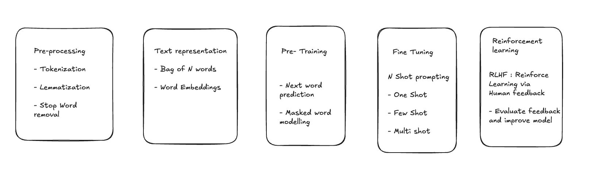

## LLM Internals

The branch of AI from broad to most specific in the branch -
**Artificial Intelligence -> Machine Learning -> Deep Learning -> Large Language Models**

The term multi-modal:
An LLM can be text only or multi-modal. When we say its multi-modal it means it can process
text, image, audio and/or video in contrast to only single-mode (e.g only text support)

If a model support visual answering, then it can be classified as multi-modal.
Eg: "Describe this zebra by looking at its picture"

## 5 Stages
- Text Pre-Processing
- Text Representation
- Pre-Training
- Fine-Tuning
- Advanced Fine-Tuning

### What happens when a query is sent to LLM?

- Broken down into tokens
- Each token is then used to generate word embeddings
- Positional / byte pair encoding is done
- Vectorization
- Next word prediction is done based on vector
- Logits
